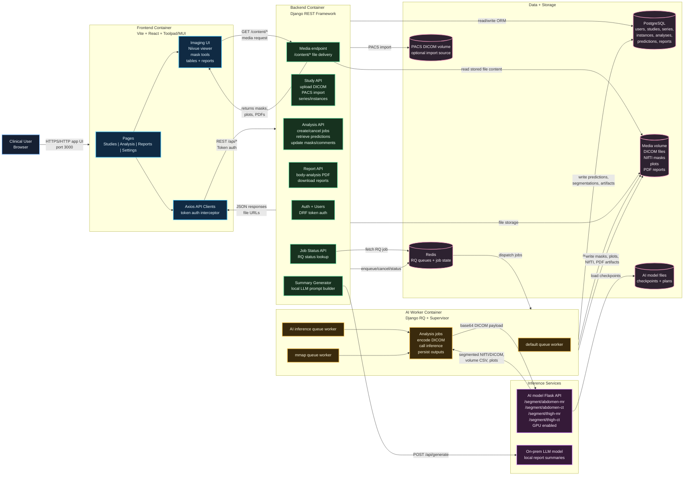
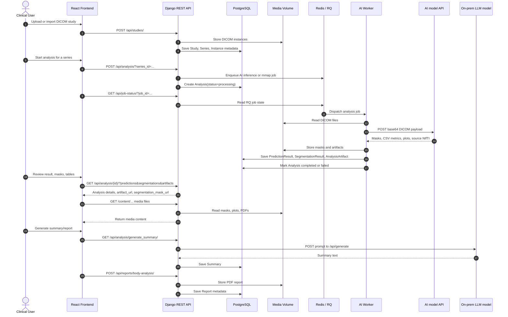
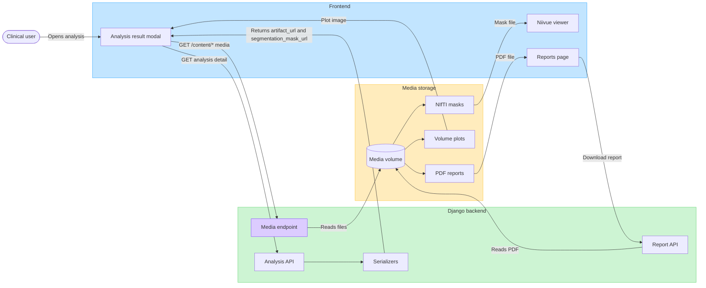
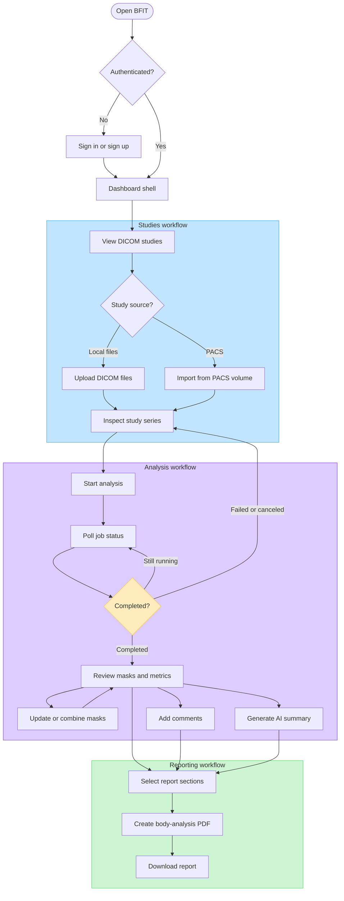
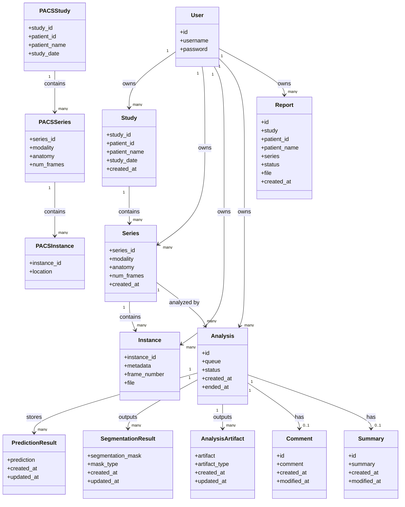
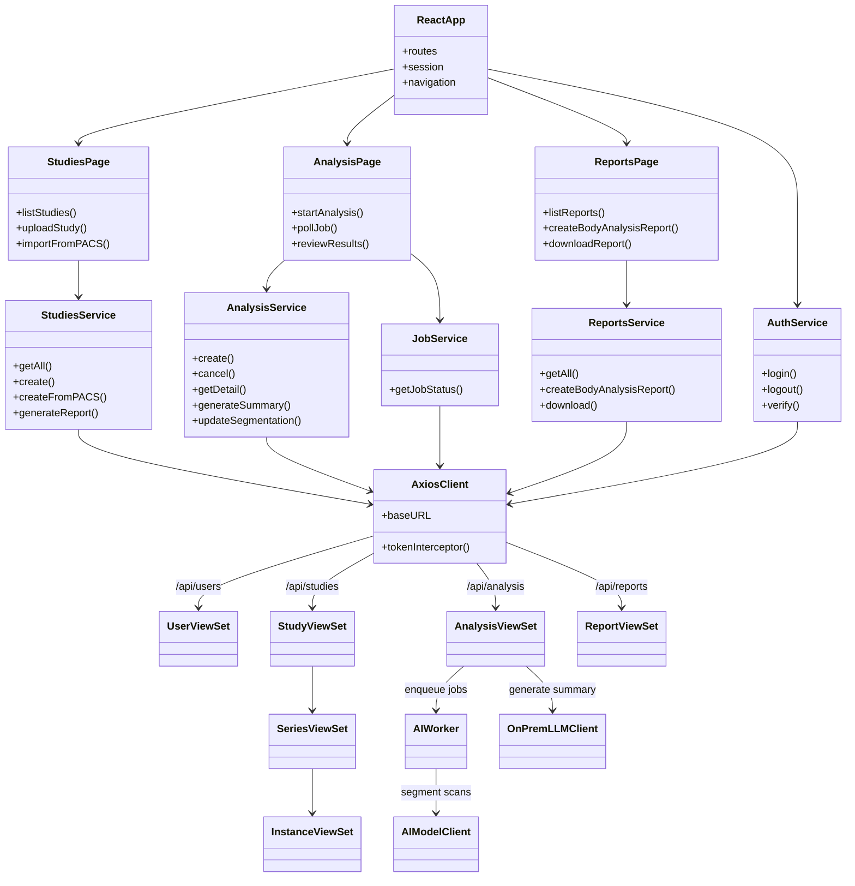

# BFIT System Architecture

Editable FigJam board: [BFIT architecture and user flow](https://www.figma.com/board/GGYAmtioiklTHRdw5zDYRq)

Large export version:
[open export page](./system-architecture-export.html),
[download high-res PNG](./system-architecture-poster-2x.png),
[download PNG](./system-architecture-poster.png),
[download SVG](./system-architecture-poster.svg)

Note: the editable FigJam board contains the architecture and user interaction flow diagrams. The class diagrams are included below in Mermaid because FigJam diagram generation does not support class diagrams.

## Primary Runtime Flow

## Media Return Flow

## Key Components

| Layer | Component | Responsibility |
| --- | --- | --- |
| UI | `WebGUI/frontend` | React/Vite application for DICOM studies, analysis review, Niivue viewing, segmentation tools, and reports. |
| API | `WebGUI/backend/src/bfitapp` | Django project wiring routes, settings, storage, database, and RQ queue configuration. |
| Domain API | `WebGUI/backend/src/bfitserver` | DRF viewsets and models for users, studies, series, instances, analyses, predictions, segmentations, comments, summaries, and reports. |
| Async processing | `ai_worker` | Runs AI inference, mmap, and default RQ workers under Supervisor. |
| Queue | Redis | Stores RQ queues and job state for async analysis and status polling. |
| Database | PostgreSQL | Stores relational metadata and JSON prediction payloads. |
| File storage | Media volume | Stores uploaded DICOM files, generated NIfTI masks, plots, artifacts, and PDF reports; the backend returns these to the frontend through `/content/*` URLs and serializer fields such as `artifact_url` and `segmentation_mask_url`. |
| Inference | AI model service | Flask API that converts DICOM/NIfTI, runs segmentation, computes volume outputs, and returns base64 artifacts. |
| Local AI summary | On-prem LLM model | Generates analysis summaries from backend-built prompts. |

## Deployment View

The production compose stack in `src/docker-compose.yaml` runs these services:

- `frontend` on port `3000`
- `backend` on port `8000`
- `ai_worker` with Supervisor/RQ dashboard port `9001`
- `redis` on port `6379`
- `postgres` exposed as host port `5433` to container port `5432`
- AI model service on port `5000` with NVIDIA GPU access
- On-prem LLM model on port `11434` with NVIDIA GPU access

The development override in `src/docker-compose.dev.yaml` bind-mounts the frontend, backend, and AI model source directories and adds `ai_worker_mon` on port `9181`.

## User Interaction Flow

## Backend Domain Class Diagram

## API And Frontend Class Diagram

